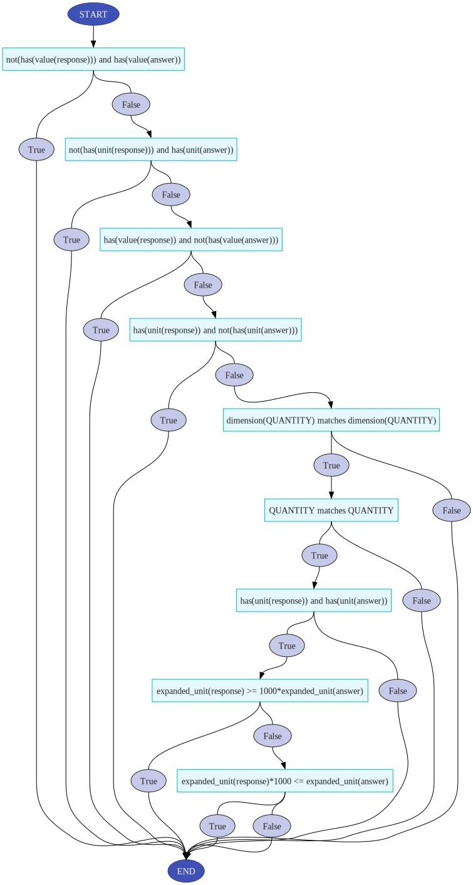

# CompareExpressions

This function utilises the [`SymPy`](https://docs.sympy.org/latest/index.html) to provide a maths-aware comparsion of a student's response to the correct answer. This means that mathematically equivalent inputs will be marked as correct. Note that `pi` is a reserved constant and cannot be used as a symbol name.

Note that this function is designed to handle comparisons of mathematical expressions but has some limited ability to handle comparison of equalities as well. More precisely, if the answer is of the form $f(x_1,\ldots,x_n) = g(x_1,\ldots,x_n)$ and the response is of the form $\tilde{f}(x_1,\ldots,x_n) = \tilde{g}(x_1,\ldots,x_n)$ then the function checks if $f(x_1,\ldots,x_n) - g(x_1,\ldots,x_n)$ is a multiple of $\tilde{f}(x_1,\ldots,x_n) / \tilde{g}(x_1,\ldots,x_n)$.

## Inputs

### Optional parameters

There are eight optional parameters that can be set: `complexNumbers`, `convention`, `criteria`, `multiple_answers_criteria`, `elementary_functions`, `physical_quantity`, `plus_minus`/`minus_plus`, `specialFunctions`, `strict_syntax`, `symbol_assumptions`.

## `complexNumbers`

If you want to use `I` for the imaginary constant, set the grading parameter `complexNumbers` to True.

## `convention`

Changes the implicit multiplication convention. If unset it will default to `equal_precedence`.

If set to `implicit_higher_precedence` then implicit multiplication will have higher precedence than explicit multiplication, i.e. `1/ab` will be equal to `1/(ab)` and `1/a*b` will be equal to `(1/a)*b`.

If set to `equal_precedence` then implicit multiplication will have the same precedence than explicit multiplication, i.e. both `1/ab` and `1/a*b` will be equal to `(1/a)*b`.

## `criteria`

The `criteria` parameter can be used to customize the comparison performed by the evaluation function. If unset the evaluation function will will default to checking if the answer and response are symbolically equal.

The `criteria` parameter takes a string that defines a set of (comma separated) mathematical statements. If all statements in the list are true the response is considered correct.

The `criteria` parameter reserves `response` and `answer` as keywords that will be replaced y the response and answer respectively when the criteria is checked. Setting `criteria` to `answer=response` is gives the same behaviour as leaving `criteria` unset.

**Note:** Currently the `criteria` parameter is ignored if `physical_quantity` is set to true.

**Note:** The `criteria` parameters functionality is currently under development and will rarely produce appropriate feedback and can be quite difficult to debug.

## `elementary_functions`

When using implicit multiplication function names with mulitple characters are sometimes split and not interpreted properly. Setting `elementary_functions` to true will reserve the function names listed below and prevent them from being split. If a name is said to have one or more alternatives this means that it will accept the alternative names but the reserved name is what will be shown in the preview.

`sin`, `sinc`, `csc` (alternative `cosec`), `cos`, `sec`, `tan`, `cot` (alternative `cotan`), `asin` (alternative `arcsin`), `acsc` (alternatives `arccsc`, `arccosec`), `acos` (alternative `arccos`), `asec` (alternative `arcsec`), `atan` (alternative `arctan`), `acot` (alternatives `arccot`, `arccotan`), `atan2` (alternative `arctan2`), `sinh`, `cosh`, `tanh`, `csch` (alternative `cosech`), `sech`, `asinh` (alternative `arcsinh`), `acosh` (alternative `arccosh`), `atanh` (alternative `arctanh`), `acsch` (alternatives `arccsch`, `arcosech`), `asech` (alternative `arcsech`), `exp` (alternative `Exp`), `E` (equivalent to `exp(1)`, alternative `e`), `log`, `sqrt`, `sign`, `Abs` (alternative `abs`), `Max` (alternative `max`), `Min` (alternative `min`), `arg`, `ceiling` (alternative `ceil`), `floor`

## `multiple_answers_criteria`

The $\pm$ and $\mp$ symbols can be represented in  the answer or response by `plus_minus` and `minus_plus` respectively.

Answers or responses that contain $\pm$ or $\mp$ has two possible interpretations which requires further criteria for equality. The grading parameter `multiple_answers_criteria` controls this. The default setting, `all`, is that each answer must have a corresponding answer and vice versa. The setting `all_responses` check that all responses are valid answers and the setting `all_answers` checks that all answers are found among the responses.

## `physical_quantity`

If unset, `physical_quantity` will default to `false`. 

If `physical_quantity` is set to `true` the answer and response will interpreted as a physical quantity using units and conventions decided by the `strictness` and `units_string` parameters.

**Remark:** Setting `physical_quantity` to `true` will also mean that comparisons will be done numerically. If neither the `atol` nor `rtol` parameters are set, the evaluation function will choose a relative error based on the number of sigificant digits given in the answer.

When `physical_quantity` the evaluation function will generate feedback based on the flowchart below. Hovering over a criterion node will show a short natural language description of the criterion. Hovering over a result node will show the feedback produced so far.

**Remark:** In some browser it is necessary to right-click and open the image in a separate tab in order for the tooltips to show up on hover.

The supported units are listed in the tables below.

### Table: Base SI units

SI base units taken from Table 1 of the [NIST Guide to the SI, Chapter 4: The Two Classes of SI Units and the SI Prefixes](https://www.nist.gov/pml/special-publication-811/nist-guide-si-chapter-4-two-classes-si-units-and-si-prefixes)

Note that gram is used as a base unit instead of kilogram.

| SI base unit | Symbol | Dimension name       |
|--------------|:-------|:---------------------|
| metre        |   m    | `length`             |
| gram         |   g    | `mass`               |
| second       |   s    | `time`               |
| ampere       |   A    | `electric_current`   |
| kelvin       |   k    | `temperature`        |
| mole         |  mol   | `amountof_substance` |
| candela      |  cd    | `luminous_intensity` |

### Table: SI prefixes

SI base units taken from Table 5 of [NIST Guide to the SI, Chapter 4: The Two Classes of SI Units and the SI Prefixes](https://www.nist.gov/pml/special-publication-811/nist-guide-si-chapter-4-two-classes-si-units-and-si-prefixes)

| SI Prefix | Symbol | Factor     | | SI Prefix | Symbol | Factor     |
|-----------|:-------|:-----------|-|-----------|:-------|:-----------|
| quetta    |   Q    | $10^{30}$  | | deci      |   d    | $10^{-1}$  |
| ronna     |   R    | $10^{27}$  | | centi     |   c    | $10^{-2}$  |
| yotta     |   Y    | $10^{24}$  | | milli     |   m    | $10^{-3}$  |
| zetta     |   Z    | $10^{21}$  | | micro     |   mu   | $10^{-6}$  |
| exa'      |   E    | $10^{18}$  | | nano      |   n    | $10^{-9}$  |
| peta      |   P    | $10^{15}$  | | pico      |   p    | $10^{-12}$ |
| tera      |   T    | $10^{12}$  | | femto     |   f    | $10^{-15}$ |
| giga      |   G    | $10^{9}$   | | atto      |   a    | $10^{-18}$ |
| mega      |   M    | $10^{6}$   | | zepto     |   z    | $10^{-21}$ |
| kilo      |   k    | $10^{3}$   | | yocto     |   y    | $10^{-24}$ |
| hecto     |   h    | $10^{2}$   | | ronto     |   r    | $10^{-27}$ |
| deka      |   da   | $10^{1}$   | | quecto    |   q    | $10^{-30}$ |

### Table: Common non-SI units

Commonly used non-SI units taken from Table 6 and 7 of [NIST Guide to the SI, Chapter 5: Units Outside the SI](https://www.nist.gov/pml/special-publication-811/nist-guide-si-chapter-4-two-classes-si-units-and-si-prefixes)

Note that the function treats angles, neper and bel as dimensionless values.

Note that only the first table in this section has short form symbols defined, the second table does not.

| Unit name         | Symbol | Expressed in SI units                      |
|-------------------|:-------|:-------------------------------------------|
| minute            |  min   | $60~\mathrm{second}$                       |
| hour              |   h    | $3600~\mathrm{second}$                     |
| degree            |  deg   | $\frac{\pi}{180}$                          |
| liter             |   l    | $10^{-3}~\mathrm{metre}^3$                 |
| metric_ton        |   t    | $10^3~\mathrm{kilogram}$                   |
| neper             |  Np    | $1$                                        |
| bel               |   B    | $\frac{1}{2}~\ln(10)$                      |
| electronvolt      |  eV    | $1.60218 \cdot 10^{-19}~\mathrm{joule}$    |
| atomic_mass_unit  |   u    | $1.66054 \cdot 10^{-27}~\mathrm{kilogram}$ |
| angstrom          |   å    | $10^{-10}~\mathrm{metre}$                  |

| Unit name        | Expressed in SI units                                |
|------------------|:-----------------------------------------------------|
| day              | $86400~\mathrm{second}$                              |
| angleminute      | $\frac{\pi}{10800}$                                  |
| anglesecond      | $\frac{\pi}{648000}$                                 |
| astronomicalunit | $149597870700~\mathrm{metre}$                        |
| nauticalmile     | $1852~\mathrm{metre}$                                |
| knot             | $\frac{1852}{3600}~\mathrm{metre~second}^{-1}$       |
| are              | $10^2~\mathrm{metre}^2$                              |
| hectare          | $10^4~\mathrm{metre}^2$                              |
| bar              | $10^5~\mathrm{pascal}$                               |
| barn             | $10^{-28}~\mathrm{metre}$                            |
| curie            | $3.7 \cdot 10^{10}~\mathrm{becquerel}                |
| roentgen         | $2.58 \cdot 10^{-4}~\mathrm{kelvin~(kilogram)}^{-1}$ |
| rad              | $10^{-2}~\mathrm{gray}$                              |
| rem              | $10^{-2}~\mathrm{sievert}$                           |

### Table: Imperial units

Commonly used imperial units taken from [Wikipedia: Imperial units](https://en.wikipedia.org/wiki/Imperial_units)

| Unit name         | Symbol | Expressed in SI units                         |
|-------------------|:-------|:----------------------------------------------|
| inch              |   in   | $0.0254~\mathrm{metre}$                       |
| foot              |   ft   | $0.3048~\mathrm{metre}$                       |
| yard              |   yd   | $0.9144~\mathrm{metre}$                       |
| mile              |   mi   | $1609.344~\mathrm{metre}$                     |
| fluid ounce       |  fl oz | $28.4130625~\mathrm{millilitre}$              |
| gill              |   gi   | $142.0653125~\mathrm{millilitre}$             |
| pint              |   pt   | $568.26125~\mathrm{millilitre}$               |
| quart             |   qt   | $1.1365225~\mathrm{litre}$                    |
| gallon            |   gal  | $4546.09~\mathrm{litre}$                      |
| ounce             |   oz   | $28.349523125~\mathrm{gram}$                  |
| pound             |   lb   | $0.45359237~\mathrm{kilogram}$                |
| stone             |   st   | $6.35029318~\mathrm{kilogram}$                |

## `plus_minus` and `minus_plus`

The $\pm$ and $\mp$ symbols can be represented in  the answer or response by `plus_minus` and `minus_plus` respectively.

To use other symbols for $\pm$ and $\mp$ set the grading parameters `plus_minus` and `minus_plus` to the desired symbol. **Remark:** symbol replacement is brittle and can have unintended consequences.

## `specialFunctions`

If you want to use the special functions `beta` (Euler Beta function), `gamma` (Gamma function) and `zeta` (Riemann Zeta function), set the grading parameter `specialFunctions` to True.

## `strict_syntax`

If `strict_syntax` is set to true then the answer and response must have `*` or `/` between each part of the expressions and exponentiation must be done using `**`, e.g. `10*x*y/z**2` is accepted but `10xy/z^2` is not.

If `strict_syntax` is set to false, then `*` can be omitted and `^` used instead of `**`. In this case it is also recommended to list any multicharacter symbols expected to appear in the response as input symbols.

By default `strict_syntax` is set to true.

## `symbol_assumptions`

This input parameter allows the author to set an extra assumption each symbol. Each assumption should be written on the form `('symbol','assumption name')` and all pairs concatenated into a single string.

The possible assumption names can be found in this list: 
[`SymPy Assumption Predicates`](https://docs.sympy.org/latest/guides/assumptions.html#predicates)

## Examples

Implemented versions of these examples can be found in the module 'Examples: Evaluation Functions'.

### 1 Setting input symbols to be assumed positive to avoid issues with fractional powers

In general $\frac{\sqrt{a}}{\sqrt{b}} \neq \sqrt{\frac{a}{b}}$ but if $a > 0$ and $b > 0$ then $\frac{\sqrt{a}}{\sqrt{b}} = \sqrt{\frac{a}{b}}$. The same is true for other fractional powers.

So if expressions like these are expected in the answer and/or response then it is a good idea to use the `symbol_assumptions` parameter to note that $a > 0$ and $b > 0$. This can be done by setting `symbol_assumptions` to `('a','positive') ('b','positive')`.

The example given in the example problem set uses two EXPRESSION response areas. Both response areas uses `compareExpression` with answer `sqrt(a/b)`, `strict_syntax` set to false, `elementary_functions` set to true. One response area leaves `symbol_assumptions` unset and the other sets the parameter as described in the previous paragraph. Some examples of expressions that are accepted as correct when positivity is assumed:
`sqrt(a)/sqrt(b)`, `(a/b)**(1/2)`, `a**(1/2)/b**(1/2)`, `(a/b)^(0.5)`, `a^(0.5)/b^(0.5)`

### 2 Using plus/minus symbols

The $\pm$ and $\mp$ symbols can be represented in  the answer or response by `plus_minus` and `minus_plus` respectively. To use other symbols for $\pm$ and $\mp$ set the grading parameters `plus_minus` and `minus_plus` to the desired symbol. **Remark:** symbol replacement is brittle and can have unintended consequences.

It is considered good practice to make sure that the appropriate notation for $\pm$ and $\mp$ are added and displayed as input symbols in order to minimize confusion.

The example given in the example problem set uses an EXPRESSION response area that uses `compareExpression` with answer `plus_minus x**2 + minus_plus y**2`, `strict_syntax` set to false and `elementary_function` set to true. Some examples of expressions that are accepted as correct:
`plus_minus x**2 + minus_plus y**2`, `- minus_plus x**2 + minus_plus y**2`, `- minus_plus x^2 minus_plus y^2`, `- minus_plus x^2 - plus_minus y^2`

### 3 Equalities in the answer and response

There is (limited) support for using equalities in the response and answer.

The example given in the example problem set uses an EXPRESSION response area that uses `compareExpression` with answer `x**2-5*y**2-7=0`. Some examples of expressions that are accepted as correct:
`x**2-5*y**2-7=0`, `x^2 = 5y^2+7`, `2x^2 = 10y^2+14`

### 4 Checking the value of an expression or a physical quantity

If the parameter `physical_quantity` is set to true, the evaluation function can handle expressions that describe physical quantities. Which units are permitted and how they should be written depends on the `units_string` and `strictness` parameters respectively.

There are three examples in the example problem set. Each examples uses an EXPRESSION response area that uses `compareExpression` with answer `strict_syntax` set to false and `physical_quantity` set to true.

#### Example (a)

Here the answer is `2.00 km/h`. The parameters `strictness` and `units_string` are left unset which is equivalent to setting `strictness` to `natural`, and `units_string` to `SI common imperial`. Thus this response area accepts a wide range of responses, e.g. `2.00 kilometre/hour`, `2 km/h`, `2000 meter/hour`, `2 metre/millihour`

#### Example (b)

Here the answer is `2.00 km/h`. To restrict the answers to SI units `strictness` is set to `strict` and `units_string` is set to `SI`. Some examples of accepted responses are: `0.556 metre/second`, `5.56 dm/s`, `55.6 centimetre second^(-1)`

#### Example (c)

Here the answer is `2.00 km/h`. To restrict the answers to imperial units `strictness` is set to `strict` and `units_string` is set to `imperial common`. Accepted response: `1.24 mile/hour`
